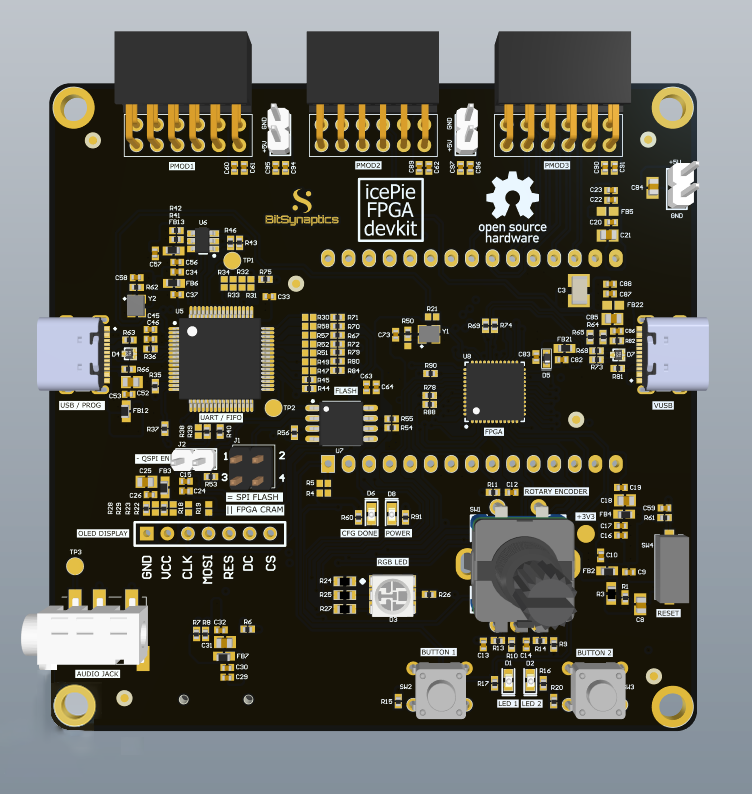

# icePie FPGA devkit - Examples



Examples codes demonstrating various hardware features built into the icePie FPGA devkit board. 

## Requirements: 

* [apio](https://github.com/FPGAwars/apio)
	```bash
	pip install apio@git+https://github.com/bitsynaptics/apio
	apio install --all
	apio drivers --ftdi-enable
	```

  * Use `apio build` and `apio upload` in example directories with `apio.ini` file. `apio clean` for clearing build files. 
 
* [oss-cad-suite](https://github.com/YosysHQ/oss-cad-suite-build/releases)
  
  * Decompress the package and run `source environment` inside the oss-cad-suite directory.
  * Add the `bin` directory to PATH in `.bash_profile` for convenience (ex: `export PATH=$PATH:~/fpga/oss-cad-suite/bin`).
  * Use `make` and `make prog` on example directories with `Makefile`. `make clean` for clearing build files.

* For Windows users, follow the [Windows Toolchain Install Guide](docs/icePie%20FPGA%20devkit%20-%20Windows%20Toolchain%20Install%20Guide.pdf)
  
## Pin Mapping:

The icePie FPGA devkit board is based on [1BitSquared iCEBreaker FPGA Board](https://1bitsquared.com/products/icebreaker), with similar pin mappings. 
For details on shared IOs for OLED, SD Card, Encoder, Buttons and ESP32 GPIOs, see [icePie.pcf](/demo/icePie.pcf) pin constraints file. 

## Licenses

Applicable license is individual to each IP core / project and is mentioned
in the IP core / example directory itself and in each file.


